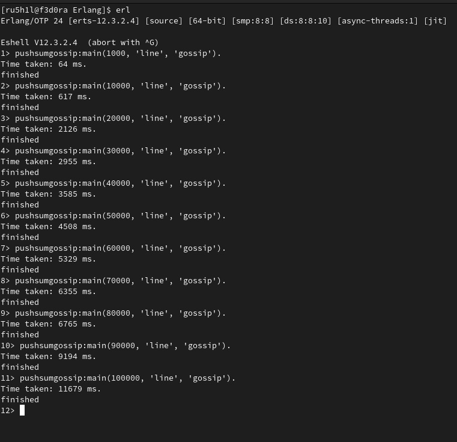
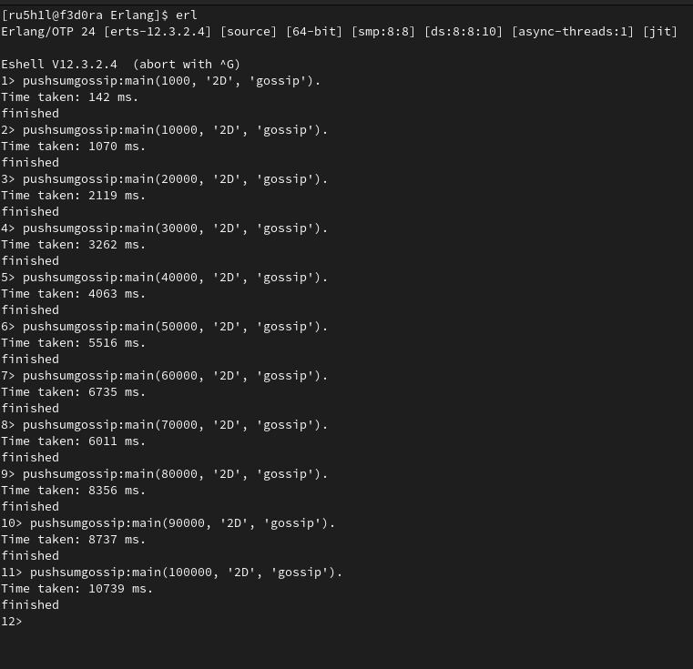
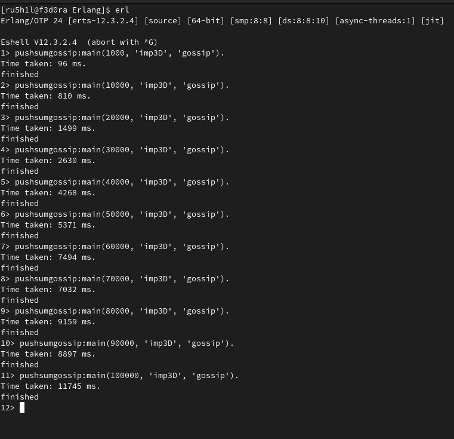
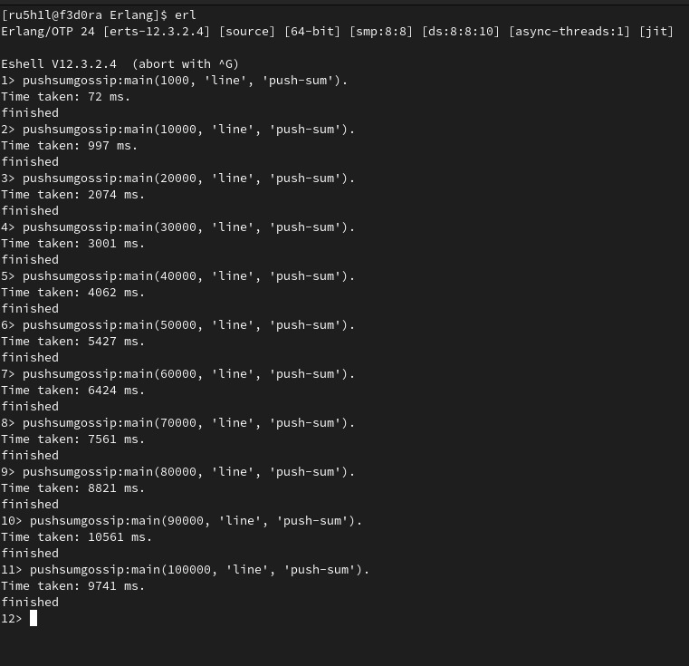
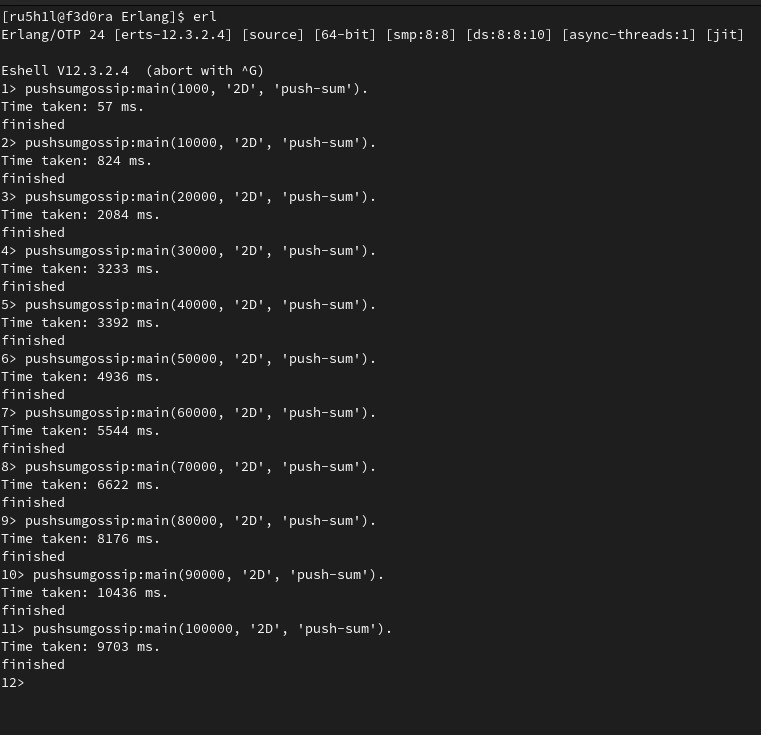
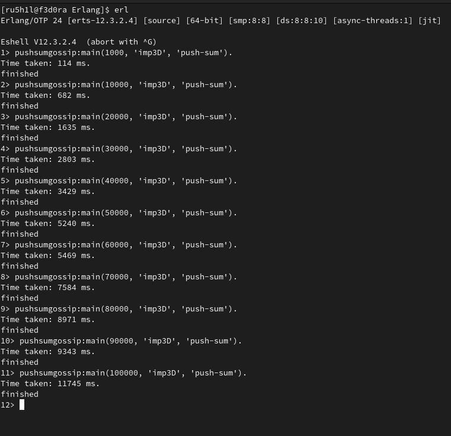

# Project 2
### Raj Vora - 35551411
### Rushil Patel - 66999320

## Problem Definition

Implement PushSum and Gossip Protocols for the following topologies:

- Line
- Full
- 2D
- Imp3D

## Input

The input provided is of the form:
pushsumgossip:main(numNodes, topology, algorithm).
Where numNodes is the number of actors involved (for 2D based topologies you can round up until you get a square),Topology is full, 2D, line, imp3D and algorithm  is gossip, push-sum.

## Working

We managed to run Gossip protocol and the pushsum protocol for all the topologies mentioned. Attaching all 8 runtimes for upto 100000 nodes

If we have n nodes, the time taken for the protocol to complete should be n/10 ms, which matches in the majority of the cases.

## Graphs

